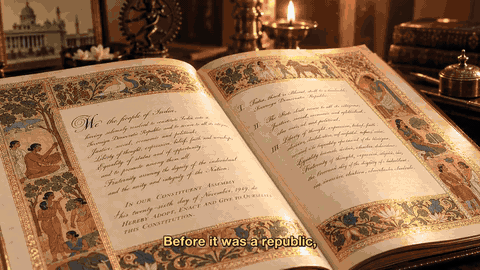
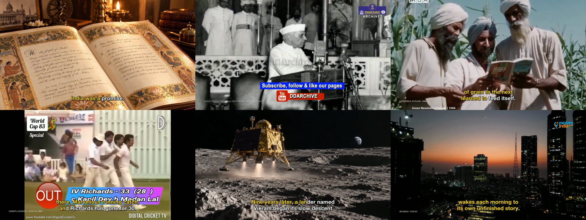
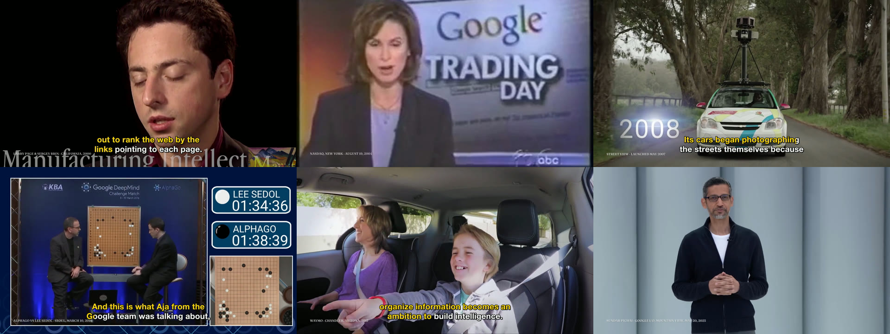
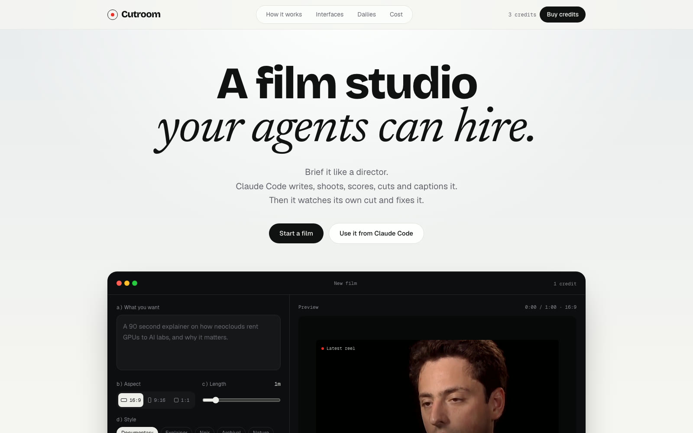
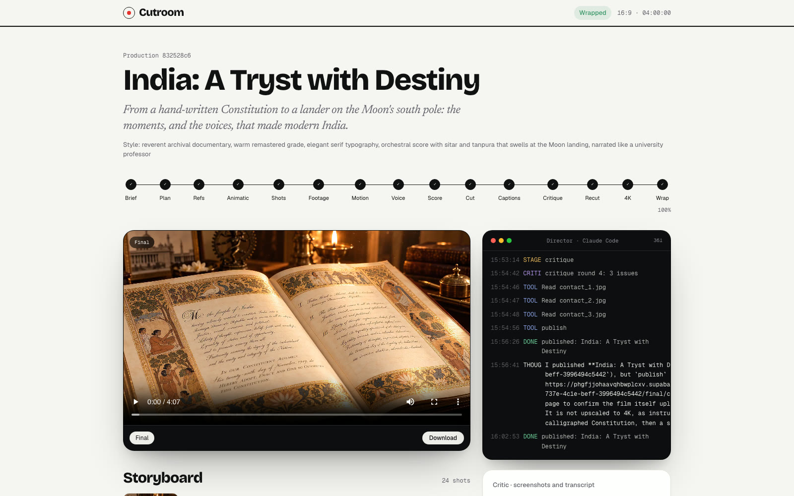
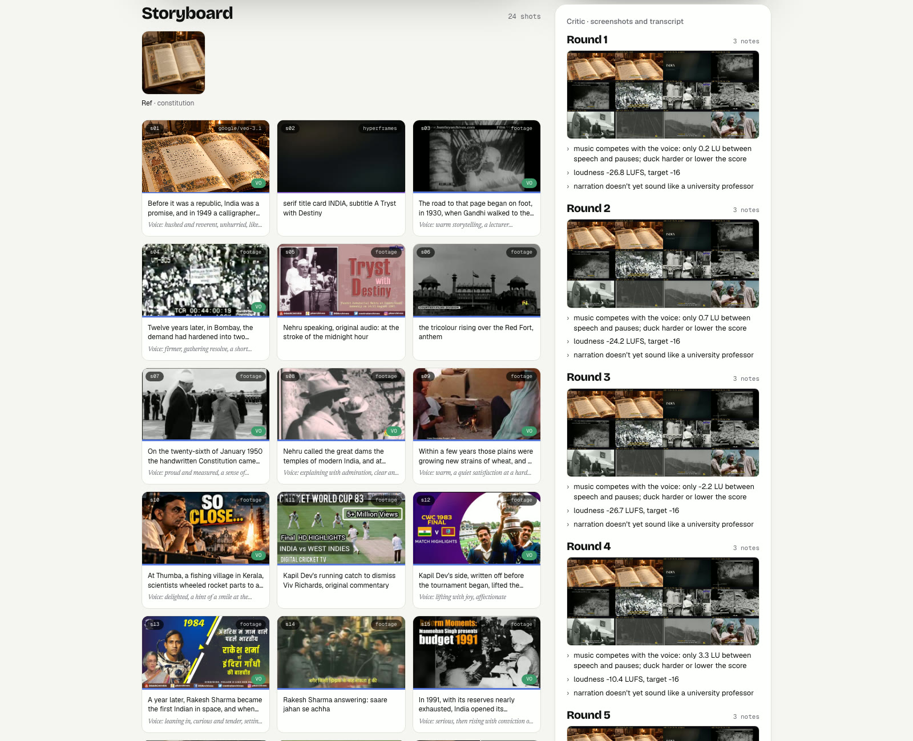
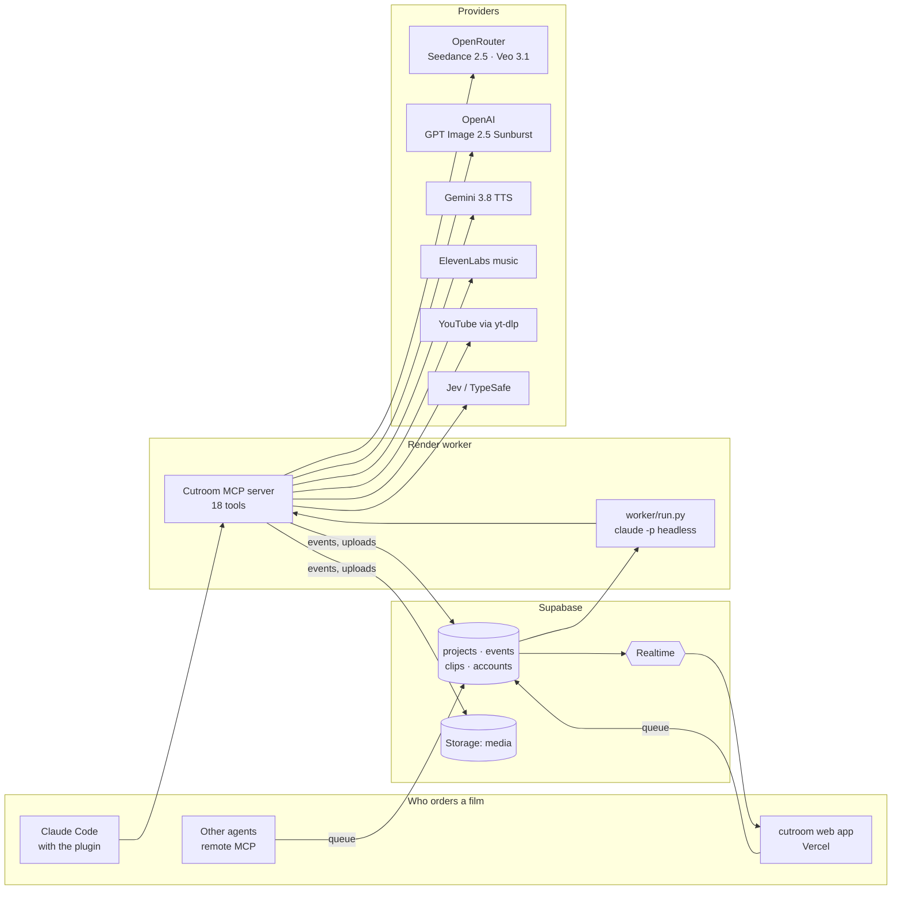

<h1 align="center">Cutroom</h1>

<p align="center"><b>A film studio your agents can hire.</b><br>
Brief Claude Code on a film; it plans, shoots, scores, cuts, captions, critiques and publishes it.</p>

<p align="center">
  <a href="https://cutroom-zeta.vercel.app"><b>Live studio</b></a> ·
  <a href="#install-in-claude-code">Install</a> ·
  <a href="#how-a-film-gets-made">How it works</a> ·
  <a href="#self-hosting">Self-host</a>
</p>

<p align="center">
  
  
  
  
  
  
</p>

<p align="center">
  <a href="https://phgfjjohaavqhbwplcxv.supabase.co/storage/v1/object/public/media/projects/832528c6-737e-4c1e-beff-3996494c5442/final/india_a_tryst_with_destiny.mp4">
    
  </a><br>
  <sub><b>India: A Tryst with Destiny</b>: 4 minutes, 23 shots, directed end to end by Claude Code. <a href="https://phgfjjohaavqhbwplcxv.supabase.co/storage/v1/object/public/media/projects/832528c6-737e-4c1e-beff-3996494c5442/final/india_a_tryst_with_destiny.mp4">Watch the film</a> · <a href="https://cutroom-zeta.vercel.app/p/832528c6-737e-4c1e-beff-3996494c5442">See how it was made</a></sub>
</p>

---

Cutroom turns a four-part brief into a finished, captioned film with a credits ledger:

> **a)** India: a tryst with destiny, the iconic moments of modern Indian history · **b)** 16:9 · **c)** 4 minutes ·
> **d)** reverent archival documentary, serif typography, narrated like a university professor

Claude Code is the director. Cutroom gives it a crew (an MCP server with 18 tools) and a set of skills that encode how
a good documentary is made: plan first, lock references, review an animatic before spending on video, use real
footage with its original sound, never narrate like a chatbot, and critique your own cut before you publish it.

Every step streams live to the studio page, so you can watch a film being made: the plan, the reference images,
the footage it chose, each critique round and the final cut.

## Films made with Cutroom

Every frame below was planned, sourced, cut, captioned and critiqued by Claude Code. Nobody edited these by hand.

**India: A Tryst with Destiny** · 4 min · 23 shots · original audio of Nehru's midnight speech and the ISRO control room · [watch](https://phgfjjohaavqhbwplcxv.supabase.co/storage/v1/object/public/media/projects/832528c6-737e-4c1e-beff-3996494c5442/final/india_a_tryst_with_destiny.mp4) · [how it was made](https://cutroom-zeta.vercel.app/p/832528c6-737e-4c1e-beff-3996494c5442)



**Google: Organizing the World** · 90 s · 12 archival clips · ElevenLabs narrator and orchestral score · [watch](https://phgfjjohaavqhbwplcxv.supabase.co/storage/v1/object/public/media/projects/f704869c-474c-451f-a0c5-848ecc0c2ef3/final/google_organizing_the_world.mp4) · [how it was made](https://cutroom-zeta.vercel.app/p/f704869c-474c-451f-a0c5-848ecc0c2ef3)



## The studio

Brief a film on the web, or from Claude Code, or from any agent over MCP.



Then watch it get made: the director's live log, the stage rail, every cut, and the final film.



The storyboard fills in as shots land, next to every critique round the director ran on its own cut.



## What's in the box

| Stage | How |
|---|---|
| Script and shot plan | `script-planning` skill: structure by length, ~2.3 words/s, a shot per idea, a voice direction per line |
| Narration voice | "Narrate like a university professor." Full connected sentences; no punchy fragments, number stacking or rhetorical set-ups |
| Reference images and keyframes | GPT Image 2.5 **Sunburst**, with references passed to every shot for consistency |
| Animatic | Keyframes plus scratch voice on the plan's timing, reviewed before any video is generated |
| Generated shots | **Seedance 2.5** for motion, **Veo 3.1** for everything else, through one OpenRouter key (Veo direct via Gemini as fallback) |
| Real footage | `yt-dlp` search, section-only downloads, original audio for famous lines (`keep_audio`), and `clip_transcript` to find the exact seconds of a quote |
| Motion graphics | **Hyperframes** (HTML), **Manim**, **Motion Canvas** and **Blender** (titles, lower thirds, charts, maps, timelines) |
| Voice | **Gemini 3.8 Flash TTS** with per-line emotion direction and inline vocal tags (`voice-emotion` skill) |
| Music | **ElevenLabs** music, composed in the background and ducked under the voice |
| Assembly | **OpenTimelineIO** timeline (opens in Resolve or Premiere), rendered with ffmpeg, −16 LUFS |
| Captions | Whisper large-v3-turbo (MLX) word-level timestamps, burned in with the current word highlighted |
| Critic | Contact-sheet screenshots, transcript-vs-script diff, loudness, black/frozen frames, ducking checks |
| Fast decisions | **Jev** (TypeSafe) routes each shot to an engine, ranks footage and flags AI-sounding narration, with calibrated confidence |
| 4K | Real-ESRGAN upscale, with a fast path when the AI estimate won't fit the time budget |
| Publishing | Supabase Storage, a credits ledger for every clip and track, and a public gallery |

## Install in Claude Code

```bash
claude plugin marketplace add KaushikSiva/cutroom
claude plugin install cutroom@cutroom
```

Then, in Claude Code:

```
Use the cutroom make-video skill.
a) A 60-second explainer on why data centres are built beside rivers
b) 16:9  c) 60 s  d) calm documentary, dusk light, narrated like a university professor
```

The tools server needs Python 3.12, ffmpeg and the API keys below; see [Self-hosting](#self-hosting).

### Order a film from another agent

Every account on the live site gets an API key. Point any MCP client at the remote server:

```bash
claude mcp add --transport http cutroom "https://cutroom-zeta.vercel.app/api/mcp?key=cr_YOUR_KEY"
```

Tools: `make_video`, `get_status`, `get_credits`, `list_videos`, `buy_credits` (Stripe checkout).

## How a film gets made



1. **Brief.** `project_start` creates the project with the brief, aspect ratio, length and style.
2. **Plan.** The director scouts footage, then saves a shot plan: kind, duration, narration and voice direction for each shot.
3. **References and keyframes.** One reference image per recurring subject; a keyframe per generated shot.
4. **Animatic.** Stills and scratch voice on the plan's timing, critiqued before money is spent on video.
5. **Production.** Generated shots, archival sections, motion graphics, voiceover and music, in parallel.
6. **Assemble, caption, critique, recut.** Up to three rounds, until the critic finds nothing above minor.
7. **Publish.** Upload, poster frame, credits ledger, gallery.

### MCP tools

`project_start` · `save_plan` · `gen_reference` · `gen_keyframe` · `render_animatic` · `gen_shot` · `search_footage` ·
`clip_transcript` · `add_clip` · `motion_graphic` · `voiceover` · `music` · `assemble` · `captions` · `critique` ·
`upscale_4k` · `publish` · `get_project`

### Skills

`make-video` · `script-planning` · `voice-emotion` · `keyframes-and-shots` · `footage` · `motion-graphics` ·
`assemble-otio` · `captions` · `critic`

## Self-hosting

**Requirements:** macOS or Linux, Python 3.12, Node 20+, ffmpeg, and optionally Blender 4.2+ and Manim.

```bash
git clone https://github.com/KaushikSiva/cutroom && cd cutroom
cp .env.example .env                       # fill in the keys below
python3 -m venv plugin/server/.venv
plugin/server/.venv/bin/pip install -r plugin/server/requirements.txt
```

1. **Supabase.** Create a project, run `supabase/schema.sql` then `supabase/002_web.sql`, and enable anonymous sign-ins.
2. **Keys** in `.env`:

   | Key | Used for |
   |---|---|
   | `SUPABASE_URL`, `SUPABASE_ANON_KEY`, `SUPABASE_SERVICE_ROLE_KEY` | projects, live events, storage |
   | `OPENROUTER_API_KEY` | Seedance 2.5, Veo 3.1, image models |
   | `OPENAI_API_KEY` | GPT Image 2.5 Sunburst keyframes |
   | `GEMINI_API_KEY` | Gemini 3.8 TTS; Veo 3.1 fallback |
   | `ELEVENLABS_API_KEY` | music; Scribe ASR fallback |
   | `TYPESAFE_API_KEY` | Jev routing and narration checks |
   | `STRIPE_SECRET_KEY`, `STRIPE_WEBHOOK_SECRET` | credit packs on the web app |
   | `CUTROOM_FOOTAGE_LICENSE` | `cc` (default) for Creative Commons only, `any` for all of YouTube |

   Every provider has a fallback (placeholder keyframes, a Ken Burns move, the system voice, a synthesised pad), so a
   film always comes out, even with only Supabase configured.
3. **Web app.** `cd web && pnpm install && pnpm dev`, or deploy the `web/` folder to Vercel with the same env vars.
4. **Worker.** `plugin/server/.venv/bin/python worker/run.py` picks up films ordered on the site or by agents and
   directs each one with `claude -p` and the plugin.

## Credits and footage

Every clip, music track and generated asset is recorded with its source and license, and the published film carries
that ledger. By default footage search is limited to Creative Commons videos; if you switch it to `any`, you are
responsible for having the rights to what you publish.

## License

MIT
